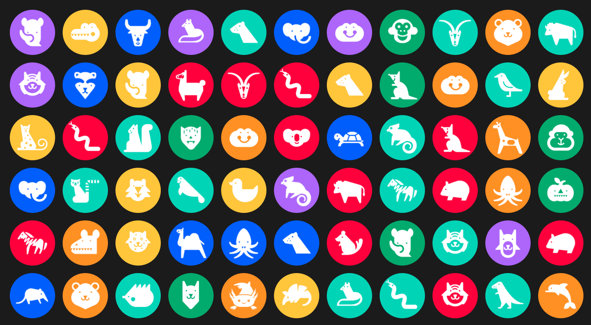
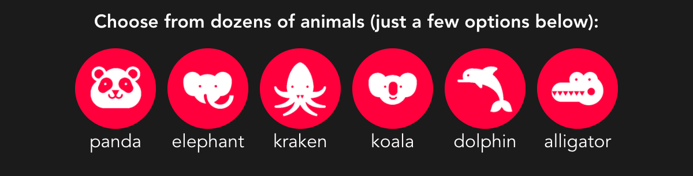
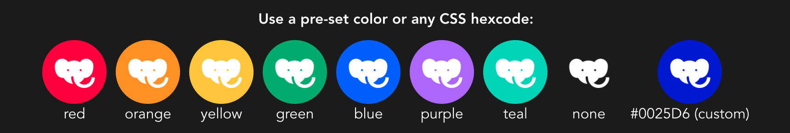
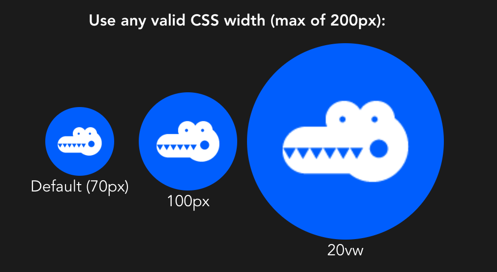
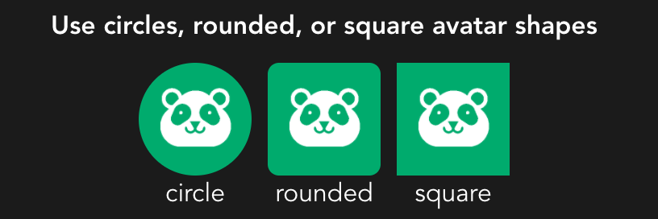
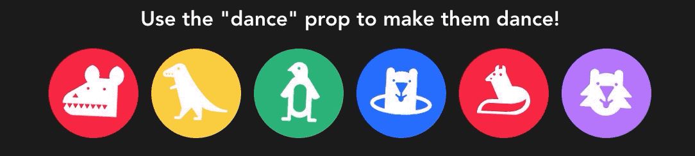

# vue-animals



A Vue component to add customizable animal avatars to any project. Inspired by the Google Docs "Anonymous Animals", all images designed by [Jefferson Cheng](https://jeffersoncheng.com/Anonymous-Animals) and property of Google.

## Installation Process

Install from NPM:

```
npm install vue-animals
```

Register the component globally (inside `main.js`):

```javascript
import animal from "vue-animals";
Vue.component("v-animal", animal);
```

...or register the component locally (preferred):

```javascript
import animal from "vue-animals";
export default {
  components: {
    "v-animal": animal
  }
};
```

Once you've successfully added a component, simply add it to a file:

```html
<v-animal />
```

By default, this avatar is circular, 70px wide, and has a random color and animal. The available customizations are below.

## Select an Animal



To specify an animal, use the `name` prop:

```html
<v-animal name="alligator" />
```

If you provide an invalid name, a random name will be used by default and a console error will be thrown. A full list of animals is available [here](https://medium.com/@roeder/these-are-all-of-the-anonymous-google-docs-animals-i-have-seen-so-far-8e33e0405993).

## Select a Color



To specify an color, use the `color` prop:

```html
<!--Use a predefined color-->
<v-animal color="red" />
<!--Use a hex-code -->
<v-animal color="#856EE7" />
```

For colors, you may use pre-selected colors like `red, orange, yellow, green, purple, teal` (all dark-mode friendly), or you may use `none` for a transparent background. You can also provide a valid CSS hexcode as well. If you provide an invalid color, a random color will be used by default and a console error will be thrown.

## Select a Size



To specify a size, use the `size` prop:

```html
<v-animal size="100px" />
<v-animal size="10vw" />
<v-animal size="25%" />
```

Although pixel (px units) are preferred, this component supports any valid CSS width unit. By design, the height and width of the avatar will be the same. If you provide an invalid CSS width, a standard width of `70px` will be used instead and a console error will be thrown. The max-width and height are 200px (to preserve image quality)

## Select a Shape



To specify a shape, you'll need to provide a particular shape prop:

```html
<!--Use default circular shape, no prop needed-->
<v-animal />
<!--Use a rounded square -->
<v-animal rounded />
<!--Use a normal square -->
<v-animal square />
```

If you provide both a `square` and `rounded` prop, the `rounded` option will be preferred. By default, all avatars will be circular.

## Dance!



To animate an avatar, use the `dance` prop:

```html
<!--Use default circular shape, no prop needed-->
<v-animal dance />
```

This will make the avatar do a repeated dancing animation. You can apply this prop dynamically so that an avatar selectively dances (such as when a cursor is hovering over it).

## All customizations

Below are some examples of vue-animals that use multiple customization props at once:

```html
<!--Alligator image, rounded square shape, random color, 70px size-->
<v-animal animal="alligator" rounded />

<!--Elephant image, square shape, blue color, 50px size-->
<v-animal animal="elephant" color="blue" size="50px" square />

<!--Animated dolphin image, circular shape, orange color, 80px size-->
<v-animal animal="dolphin" color="orange" size="80px" dance />
```

You can also add your own customizations by adding CSS classes, ID, or styles:

```html
<v-animal animal="alligator" rounded class="my-custom-css" style="..." />
```

Lastly, all props can be dynamically generated using computed properties

```html
<v-animal :animal="animalVar" :rounded="isRounded" />
```
